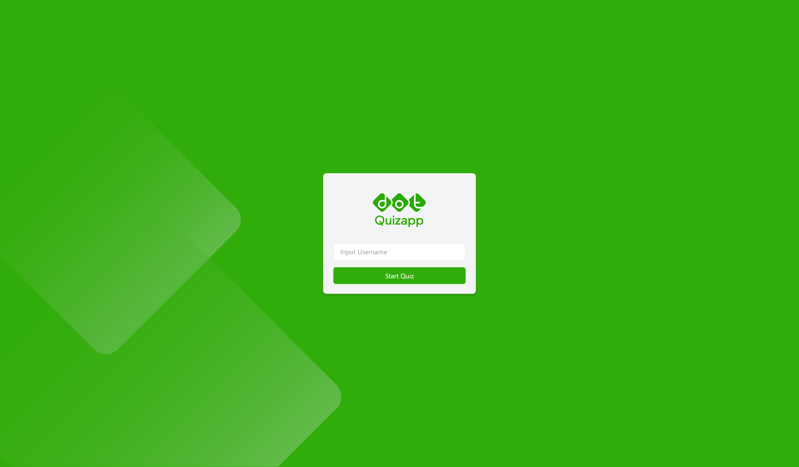
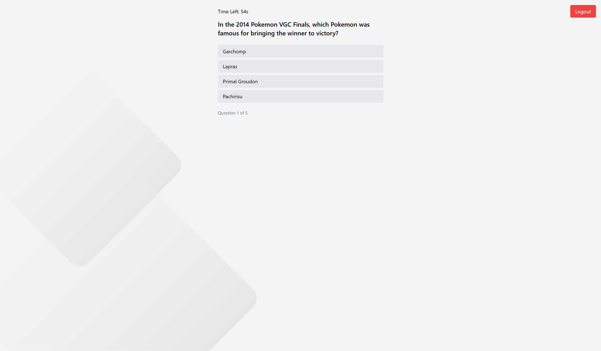
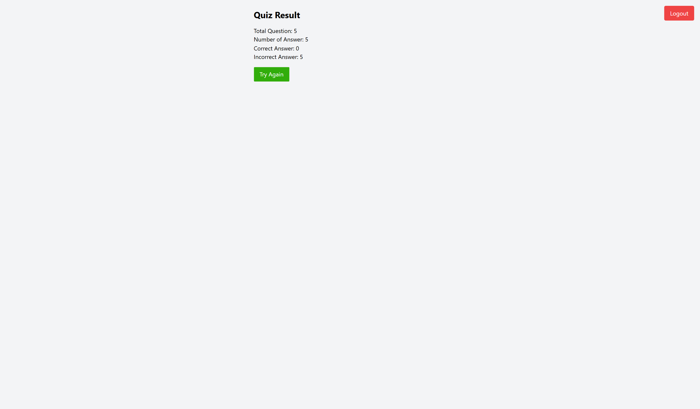

# **DOT Quiz App**

A single‑page quiz application built with **React**. The app lets users log in, take a timed quiz powered by the [Open Trivia DB](https://opentdb.com/) API, and automatically resume where they left off if the browser is closed.

---

## **Features**

1. **Authentication** – simple email + password login (extendable to OAuth).
2. **Dynamic Questions** – fetch any amount & type of questions from Open Trivia DB.
3. **Progress Tracking** – show total questions vs. answered in real‑time.
4. **Per‑Question Timer** – configurable total quiz time with automatic submission when time is up.
5. **One‑Question‑Per‑Page Flow** – instantly advances after each answer to keep users focused.
6. **Auto‑Save & Resume** – quiz state persisted in `localStorage`; users can close the tab and pick up later.
7. **Results Dashboard** – display correct, wrong, and unanswered counts with score percentage.

---

## **Project Structure**

```text
src/
│  index.js
│  App.js
├─ components/
│  ├─ QuizApp.js
├─ pages/
│  ├─ Login.js
```

## **Tech Stack**

| Purpose      | Library / Tool             |
| ------------ | -------------------------- |
| UI Framework | **React**                  |
| HTTP Client  | **Axios**                  |
| Styling      | Tailwind CSS / CSS Modules |

---

## **Getting Started**

### 1. Clone the Repository

```bash
git clone https://github.com/yondikavl/dot_quizapp.git
cd dot_quizapp
```

### 2. Install Dependencies

```bash
npm install
# or
pnpm install
```

### 3. Run the Development Server

```bash
npm run dev
# or
npm start
```

Open [http://localhost:3000](http://localhost:3000) to view the app.

---

## **Screenshots**

> _Coming soon – add your own screenshots to `public/screenshots/` and update the paths below._

| Login                                      | Quiz                                     | Result                                       |
| ------------------------------------------ | ---------------------------------------- | -------------------------------------------- |
|  |  |  |

---

## **Contact**

|            |                                                               |
| ---------- | ------------------------------------------------------------- |
| **Name**   | Yondika Vio Landa                                             |
| **Email**  | [yondikaviolanda@gmail.com](mailto:yondikaviolanda@gmail.com) |
| **GitHub** | [@yondikavl](https://github.com/yondikavl)                    |

---

### **Notes**

- Make sure you have **Node** and **npm / pnpm** installed.
- An active internet connection is required to fetch questions from Open Trivia DB.

---

**Happy quizzing!** 🎉
